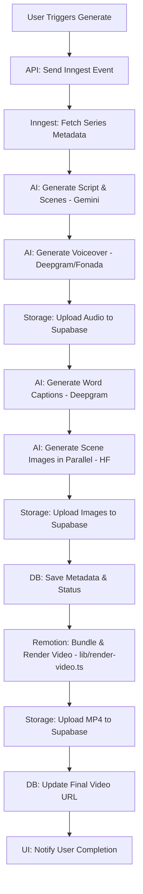

# Vidmaxx Project Architecture & Documentation

Vidmaxx is a premium AI-driven automated video creation platform designed for speed, visual excellence, and ease of use. It orchestrates multiple AI services to generate scripts, voices, images, and captions into a cohesive video product.

---

## 🏗️ Project Structure

```text
vidmaxx/
├── actions/                  # Next.js Server Actions (Database mutations, Auth logic)
├── app/                      # Next.js App Router (Routes & API)
│   ├── api/                  # Backend API Endpoints
│   │   ├── inngest/          # Inngest webhook handler
│   │   ├── series/           # Series management endpoints
│   │   ├── videos/           # Video generation and retrieval
│   │   └── voice/            # TTS synthesis & preview proxies
│   ├── dashboard/            # Authenticated User Dashboard
│   │   ├── create/           # Multi-step video generation flow
│   │   ├── series/           # User's created video series
│   │   └── videos/           # Individual video management
│   ├── (auth)/               # Authentication routes (Clerk)
│   ├── layout.tsx            # Global layout with Sidebar & Header
│   └── page.tsx              # Landing Page
├── components/               # React Components
│   ├── dashboard/            # Feature-specific dashboard components
│   └── ui/                   # Shadcn UI primitives (Buttons, Inputs, etc.)
├── hooks/                    # Custom React Hooks (use-mobile, etc.)
├── inngest/                  # Background Job Workflows
│   ├── client.ts             # Inngest client configuration
│   └── functions.ts          # Orchestration logic for video generation
├── lib/                      # Shared Utilities & Service Clients
│   ├── render-video.ts       # Remotion rendering logic (Bundling, Asset serving, MP4 generation)
│   ├── caption-service.ts    # Deepgram transcription logic
│   ├── constants.ts          # Central configuration (Voices, Languages, Niches)
│   ├── gemini.ts             # Google Gemini AI integration
│   ├── generate-image.ts     # Hugging Face Image Gen integration
│   ├── supabase.ts           # Supabase client & storage helpers
│   ├── tts-service.ts        # TTS provider logic (Deepgram/Fonada)
│   └── utils.ts              # Tailwind CSS helpers
├── remotion/                 # Remotion Video Project
│   ├── AnimatedImage.tsx     # Image pan/zoom/fade animations
│   ├── CaptionOverlay.tsx    # Word-level synchronized captions
│   ├── Root.tsx              # Composition definitions (Resolution, FPS)
│   ├── VideoComposition.tsx  # Main video orchestration and layout
│   └── video.types.ts        # Shared constants and TypeScript interfaces
├── public/                   # Static browser assets (Logo, Favicon)
├── scripts/                  # Maintenance & Utility scripts
├── ARCHITECTURE.md           # This Documentation
├── remotion.config.ts        # Remotion configuration (ESLint, Webpack)
├── package.json              # Project dependencies & scripts
└── tsconfig.json             # TypeScript configuration
```

---

## 🛠️ Technology Stack

| Category | Technology | Purpose |
|:---|:---|:---|
| **Frontend** | [Next.js 15+](https://nextjs.org/) | React Framework (App Router) |
| **Styling** | [Tailwind CSS](https://tailwindcss.com/) | Utility-first CSS framework |
| **UI Components**| [Shadcn UI](https://ui.shadcn.com/) | Reusable accessible components |
| **Authentication**| [Clerk](https://clerk.com/) | User authentication and management |
| **Database** | [Supabase](https://supabase.com/) | Postgres Database (Prisma/SQL alternative) |
| **Orchestration** | [Inngest](https://www.inngest.com/) | Event-driven background job workflows |
| **Storage** | [Supabase Storage](https://supabase.com/storage) | Hosting generated audio and images |
| **Video Rendering** | [Remotion](https://www.remotion.dev/) | Programmatic video creation in React |
| **Icons** | [Lucide React](https://lucide.dev/) | Consistent iconography |
| **Charts** | [Recharts](https://recharts.org/) | Data visualization for dashboard |

---

## 🤖 AI Models & Services

Vidmaxx leverages a multi-model approach to deliver the best results for each component:

### 1. **Google Gemini 2.5 Flash**
- **Usage**: Scripting, Scene Description, and Image Prompt Generation.
- **Why**: Extreme speed and high context understanding for creative writing.

### 2. **Deepgram Aura-2**
- **Usage**: International Text-to-Speech (English, Spanish, etc.).
- **Why**: Low-latency, human-like conversational realism.

### 3. **Fonada TTS**
- **Usage**: Specialized Indian / Hindi Voices.
- **Why**: Authentic regional accents and emotional inflection for the Indian market.

### 4. **Hugging Face (SDXL)**
- **Usage**: AI Image Generation via `stabilityai/stable-diffusion-xl-base-1.0`.
- **Why**: High-quality cinematic visuals tailored to script emotional beats.

### 5. **Deepgram Nova-2**
- **Usage**: Audio transcription to generate word-level timestamps (Captions).
- **Why**: High accuracy for synchronization with video animations.

### 6. **Remotion (Video Rendering)**
- **Usage**: Programmatic video composition and rendering to MP4.
- **Why**: Allows React-based video generation with dynamic animations, panning effects, and perfectly synchronized captions.
- **Key Files**: `lib/render-video.ts`, `remotion/Root.tsx`, `remotion/VideoComposition.tsx`.

---

## 🔄 Video Generation Pipeline (Inngest)

The core logic resides in `inngest/functions.ts` under the `video/generate.series` event:



---

## 🧩 Architectural Highlights

### The TTS Proxy Gateway
To protect API keys and handle provider switching, the frontend calls a proxy:
1. UI calls `/api/voice/preview`.
2. Server validates the Clerk session.
3. Server routes to **Deepgram** or **Fonada** based on language.
4. Audio is streamed back to the user.

### State Persistence
The multi-step video creation form (`/dashboard/create`) uses a "Lifting State Up" pattern, ensuring data remains intact between steps while allowing users to navigate back and forth without data loss.

---

## 🚀 Operational Workflow

### 1. Project Initialization & User Sync
- **Process**: When a user logs in via Clerk, the `syncUser` server action (`actions/user.ts`) is triggered.
- **Result**: A user record is created or updated in the `users` table in Supabase to maintain session consistency.

### 2. Series Creation & Event Dispatch
- **Endpoint**: `POST /api/series`
- **Interaction**: The user completes the 6-step video creation form.
- **Action**:
    1.  The backend validates and inserts the configuration into the `series` table.
    2.  An Inngest trigger `video/generate.series` is dispatched immediately with the `seriesId`.

### 3. Automated Generation Pipeline (Background)
The background orchestration is handled by **Inngest** to ensure reliability and retries:
1.  **Scripting**: Gemini 2.5 Flash crafts a narrative and detailed image prompts.
2.  **Voiceover**: `tts-service.ts` chooses between Deepgram (Global) or Fonada (Regional) based on language.
3.  **Imagery**: Scene-specific images are generated in parallel via Hugging Face (SDXL).
4.  **Captions**: Deepgram Nova-2 provides word-level timestamps for precise video synchronization.
5.  **Persistence**: Intermediate assets (audio, images) are stored in Supabase Storage.
6.  **Rendering**: `lib/render-video.ts` bundles the Remotion project, renders an MP4 via a headless browser, and uploads it to Supabase.
7.  **Finalization**: The `videos` table is updated with the `video_url` and a `completed` status.

### 4. Manual Generation Trigger
You can manually re-trigger or initiate generation for any existing series via the following endpoint:

- **Endpoint**: `POST /api/videos/generate`
- **Auth**: Required (Clerk User Session)
- **Payload**:
  ```json
  {
    "seriesId": "UUID_OF_THE_SERIES"
  }
  ```
---

## 🎨 Remotion Rendering Process

The rendering process is implemented in `lib/render-video.ts` and designed to run in serverless or containerized environments:

1.  **Asset Buffering**: Audio and images are downloaded to `/tmp` on the server.
2.  **Asset Proxy Server**: A temporary Express HTTP server is started to serve local assets (bypassing Chrome's `file://` security restrictions).
3.  **Composition Bundling**: The Remotion project is bundled on-the-fly via `@remotion/bundler`.
4.  **Headless Rendering**: `@remotion/renderer` spawns a headless browser to capture frames and encode the MP4 using `ffmpeg`.
5.  **Parallelization**: Rendering is multi-threaded, using available CPU cores to maximize performance.
6.  **Direct-to-Cloud Upload**: The final MP4 is streamed directly to Supabase Storage.
